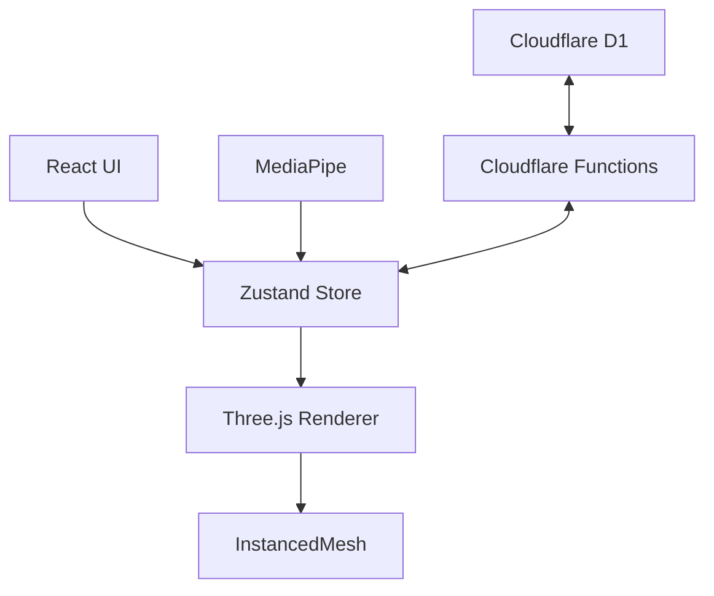

# ✨ AI Particle Architect

A high-performance WebGL simulation platform for creative computational artists. Generate, manipulate, and publish massive 3D particle swarms with neural navigation, custom AI logic, and real-time visual effects.

[](https://react.dev/)
[](https://threejs.org/)
[](https://www.typescriptlang.org/)
[](https://vitejs.dev/)
[](https://pages.cloudflare.com/)

---

## 🚀 Overview

**AI Particle Architect** is a cutting-edge creative tool that bridges the gap between code and visual art. It allows users to orchestrate tens of thousands of particles in a real-time 3D environment, offering a unique blend of mathematical precision and artistic expression. Whether you're a seasoned creative coder or a newcomer to the field, AI Particle Architect provides the tools to build stunning interactive experiences.

---

## 🎨 Key Features

### ✨ Creative Simulation
- **8 Visual Styles**: From "Spark" and "Plasma" to "Steel" and "Cyber", each style uses custom shaders for unique aesthetics.
- **High Performance**: Render up to **50,000 particles** at 60fps using Three.js `InstancedMesh`.
- **Post-Processing**: Integrated Bloom and glow effects to make your creations truly pop.

### 🤚 Intelligent Controls
- **Neural Navigation**: Control the camera and simulation parameters using hand gestures powered by **MediaPipe Hands**.
- **Hand Gesture Modes**:
  - ☝️ **Point**: Rotate the camera naturally.
  - ✌️ **Peace**: Dynamically adjust the simulation speed.
  - ✋ **Open Palm**: Smoothly zoom in and out.

### 📝 Content Creation
- **Smart Text Engine**: Convert text into dynamic particle formations with animations like Wave, Matrix, or Pulse.
- **Media Ingestion**: Import Images, Videos, and 3D Models (GLB, OBJ, PDB) to derive particle positions.
- **Blueprint/CAD Processing**: Process technical drawings into interactive 3D particle clouds.
- **Pro Drawing Pad**: A dedicated canvas for sketching custom particle paths with symmetry and depth.

### 💻 Extensible Architecture
- **Live Code Editor**: Script complex particle behaviors directly in the browser using the integrated API.
- **Real-time Controls**: Create custom UI sliders on the fly using the `addControl()` function.
- **Community Cloud**: Publish your formations to the global gallery or discover others' work.
- **Multiple Exports**: Export your work as standalone code for React, Three.js, or Vanilla JS.

---

## 🛠️ Tech Stack

| Layer | Technology |
| :--- | :--- |
| **Core** | [React 18](https://reactjs.org/), [TypeScript](https://www.typescriptlang.org/) |
| **3D Rendering** | [Three.js](https://threejs.org/), [React Three Fiber](https://docs.pmnd.rs/react-three-fiber) |
| **Styling** | [Tailwind CSS](https://tailwindcss.com/) |
| **State Management** | [Zustand](https://github.com/pmndrs/zustand) |
| **AI/ML** | [MediaPipe Hands](https://google.github.io/mediapipe/solutions/hands) |
| **Backend** | [Cloudflare Pages Functions](https://developers.cloudflare.com/pages/functions/), [Cloudflare D1](https://developers.cloudflare.com/d1/) |
| **Build Tool** | [Vite](https://vitejs.dev/) |

---

## 📦 Getting Started

### Prerequisites
- Node.js (v18 or higher)
- npm or bun

### Installation

1.  **Clone the repository:**
    ```bash
    git clone https://github.com/mualat/particle-architect.git
    cd particle-architect
    ```

2.  **Install dependencies:**
    ```bash
    npm install
    # or
    bun install
    ```

3.  **Run development server:**
    ```bash
    npm run dev
    # or
    bun run dev
    ```

4.  **Environment Setup:**
    Create a `.env` file in the root directory:
    ```env
    VITE_TURNSTILE_SITE_KEY=0x00000000000000000000AAAA
    ```
    See `.env.example` for all available options.

---

## 🏗️ Architecture

For a deep dive into how the system works, including the particle engine, state management, and backend integration.



---

## ☁️ Deployment

This project is deployed on **Cloudflare Pages** with **D1 Database**.

### Quick Deploy

```bash
# Build the project
npm run build

# Deploy to Cloudflare Pages
npm run pages:deploy
```

### Full Setup Guide

For detailed deployment instructions including:
- D1 database creation
- Environment variables configuration
- Migration setup
- Troubleshooting

See [DEPLOYMENT.md](DEPLOYMENT.md)

---

## 🔌 Custom Code API

```javascript
const size = Math.ceil(Math.sqrt(count));
const x = i % size;
const y = Math.floor(i / size);
const wave = Math.sin(x * 0.3 + time * 2) * 5;
target.set(
  (x - size/2) * 2,
  wave + (y - size/2) * 0.5,
  0
);
color.setHSL(Math.abs(wave) / 10, 1, 0.5);
```

## 🔒 Security

Custom code runs in a sandboxed environment with:
- **Forbidden keywords**: `document`, `window`, `fetch`, `eval`, `Function`, etc.
- **Syntax validation** before execution
- **Dry-run testing** with mock environment
- **Server-side validation** for published formations
- **Turnstile CAPTCHA** protection for publishing

## 🤝 Contributing

1. Fork the repository
2. Create your feature branch: `git checkout -b feature/amazing-feature`
3. Commit your changes: `git commit -m 'Add amazing feature'`
4. Push to the branch: `git push origin feature/amazing-feature`
5. Open a Pull Request

## 📝 License

MIT License - see [LICENSE](LICENSE) for details.

## 👤 Author

Made with ❤️ by **Mualat** – Open Source Maintainer

- GitHub: [@mualat](https://github.com/mualat)

---

## 🙏 Credits & References

This project was originally created by **Casberry** and has been evolved into an open-source project by Mualat.

- **Original Author**: [Casberry](https://casberry.in)
- **Website**: [casberry.in](https://casberry.in)

### Technologies
- [Three.js](https://threejs.org/) for 3D rendering
- [MediaPipe](https://mediapipe.dev/) for hand tracking
- [Cloudflare](https://www.cloudflare.com/) for edge hosting and database
- [React](https://react.dev/) for UI
- [Tailwind CSS](https://tailwindcss.com/) for styling

---

<p align="center">
  <a href="https://github.com/mualat" target="_blank">
    
  </a>
</p>
